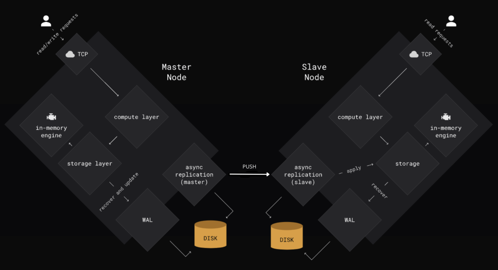
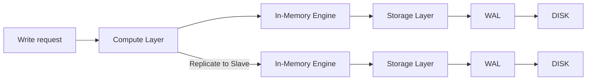
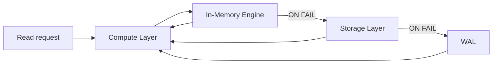

# Erdtree - Distributed Key-Value Store System

## System Overview
This is a distributed key-value store system implementing a master-slave replication pattern with Write-Ahead Logging (WAL) for durability. The system is built using Go, Connect-RPC, and Protocol Buffers, designed to provide high availability and eventual consistency.

## Architecture


## Flow Diagram 
- WRITE

- READ


### System Design

The system consists of several key components:
- Master Node
- Slave Nodes
- Write-Ahead Log (WAL)
- In-Memory Storage Engine
- Replication System

```
Master Node
├── In-Memory Storage (sync.Map)
├── Write-Ahead Log (WAL)
└── Compute Layer
    └── TCP Server (Connect-RPC)

Slave Node
├── In-Memory Storage (sync.Map)
├── Write-Ahead Log (WAL)
└── Compute Layer
    └── TCP Server (Connect-RPC)
```

## Core Components

### 1. Master Node
**Purpose**: Handles all write operations and coordinates replication to slave nodes.

**Key Responsibilities**:
- Processes write operations (SET, DELETE)
- Maintains the primary copy of data
- Logs operations to WAL
- Keeps an ongoing syncloop that syncs with slaves on an interval

**Location**: `internal/master/master.go`

**Key Methods**:
- `AddSlave(addr)`: Add a slave connection
- `RemoveSlave(addr)`: Remove a slave connection
- `ReplicateEntry(entry)`: Manual entry replication

### 2. Slave Node
**Purpose**: Maintains a replicated copy of the data and handles read operations.

**Key Responsibilities**:
- Handles read operations
- Periodically pulls updates from master
- Maintains local WAL
- Provides read-only access to data

**Location**: `internal/slave/slave.go`

**Key Methods**:
- `Get(key)`: Read operations
- `Replicate(entries)`: Receives entries that are up to be replicated into current slave node

### 3. KV Store Server (API)
**Purpose**: Provides methods to be used by nodes to manage in memory data.

**Location**: `internal/server/server.go`

**Key Features**:
- Atomic data management using sync.Map
- Why sync.Map over a regular Map? Because we're creating a cache storage that cannot be edited and can only be written or viewed. 
It's one of 2 cases when a sync.Map is more optimized, than a regular map. 
https://pkg.go.dev/sync#Map

**Key Methods**:
- `Set(key, value)`: Write operations
- `Delete(key)`: Delete operations
- `Get(key)`: Get record by key

### 4. Write-Ahead Log (WAL)
**Purpose**: Ensures durability of operations and enables recovery after crashes.

**Location**: `internal/wal/wal.go`

**Key Features**:
- Sequential write operations
- Entry format includes timestamps and operation types
- Supports recovery operations
- Manages log file rotation

**Key Methods**:
- `AppendEntry(entry)`: Logs new operations
- `Recover()`: Rebuilds state from log
- `GetEntriesSince(timestamp)`: Retrieves entries for replication

### 5. Storage Engine
**Purpose**: Manages in-memory data storage using sync.Map for thread-safe operations.

**Location**: `internal/storage/storage.go`

**Key Features**:
- Thread-safe operations using sync.Map
- Support for TTL (Time-To-Live)
- Memory management and eviction

## Communication Protocol

### Connect-RPC Service Definition
**Location**: `api/kvstore.proto`

```protobuf
service KVStore {
    rpc Get(GetRequest) returns (GetResponse);
    rpc Set(SetRequest) returns (SetResponse);
    rpc Delete(DeleteRequest) returns (DeleteResponse);
    rpc GetUpdates(GetUpdatesRequest) returns (GetUpdatesResponse);
}
```

### Data Flow
1. **Write Operation**:
   ```
   Client -> Master Node -> WAL -> In-Memory Storage
                        -> Slave Nodes (via push-based replication)
   ```

2. **Read Operation**:
   ```
   Client -> Any Node (Slave) -> In-Memory Storage
   ```

3. **Replication Flow**:
   ```
   Master -> Slave (Push updates)
   Slave -> Master (Updates Response)
   Slave -> Local WAL -> In Memory DB
   ```

## Configuration

### Master Node Configuration
```yaml
server:
  port: 8080
  address: "0.0.0.0"

wal:
  directory: "/var/log/kvstore/master"
  sync_interval: "1s"
  max_file_size: "100MB"

storage:
  max_entries: 1000000
  eviction_policy: "lru"
```

### Slave Node Configuration
```yaml
server:
  port: 8081
  address: "0.0.0.0"

master:
  address: "master:8080"
  sync_interval: "1s"

wal:
  directory: "/var/log/kvstore/slave"
  sync_interval: "1s"
```

## Getting Started

### Prerequisites
- Go 1.19 or later
- Protocol Buffer compiler
- Connect-go

### Building the System
```bash
# Generate ConnectRPC Protocol Buffer code
buf generate

# Build master and slave binaries
go build -o master ./cmd/master
go build -o slave ./cmd/slave
```

### Running the System
1. Start the master node:
```bash
./master -config master-config.yaml
```

2. Start slave nodes:
```bash
./slave -config slave-config.yaml
```

## Recovery Process

### Master Recovery
1. Reads WAL entries on startup
2. Rebuilds in-memory state
3. Resumes normal operation

### Slave Recovery
1. Reads local WAL entries
2. Rebuilds local state
3. Resumes normal operation
This project is licensed under the MIT License - see the LICENSE file for details.
